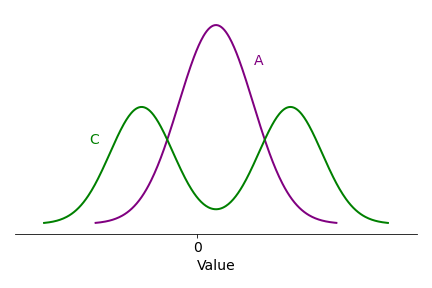
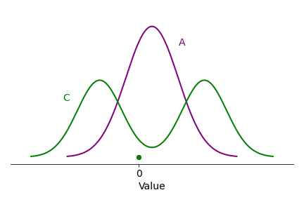
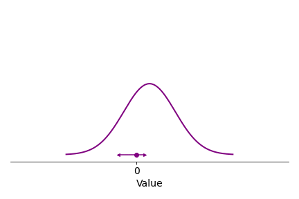
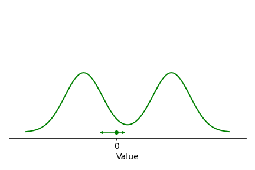
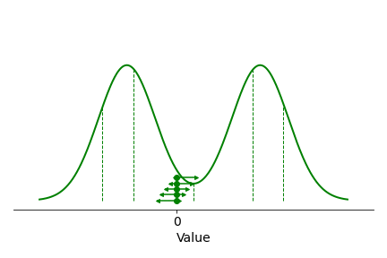

<!-- 
Todo:
* Fotnoter på nåt vis?
* A/B/C i figs
-->

*How does your brain learn to distinguish good things from bad things, and perhaps even more difficult: something average from something that might either be very good or very bad? Are you an optimist or a pessimist, or both? And how exactly does one become one or the other? This post talks about what kind of methods the brain mights be using for learning from experience, and an interesting recent development in this area combining both AI and neuroscience. The text covers some mathematical concepts, but tries to do so in a generally accessible way.*

Consider a situation where you need to decide on what to do next, and where you have reason to believe your decision will have some sort of positive or negative impact on yourself. If you happen to be a mouse in a lab where someone is doing research on reinforcement learning - learning from rewards and punishments -  you might be choosing between two levers, where one dispenses food, and the other... yeah, of course, electric shocks. Thankfully, in our human lives we are rarely directly set up for pain in this way, but the general type of choice situation is still very common, with low, high, or intermediate stakes: Which food should I pick from the buffet table? Do I cross the street now, or would it be safer to wait for that car to pass first? Which ping pong serve shold I opt for against this opponent at this point in the match? If I am ahead in the game, I might play it safe and do something easy and solid, setting me up nicely for a ball that I stand a good chance of winning, but if I am behind and tired (ping pong is hard work) I might prefer to go for my difficult Deluxe Extra™ serve, the one which few opponents can handle but which half of the times I try it goes straight into the net.

All of these situations share the common denominator of *uncertainty*. This uncertainty can be thought of as arising from inherent randomness in the world, from my limited information about the state of the world, or from both. For each choice (lever, road-crossing timing, food item, ping pong serve) I am likely have a rough but not exact idea of what will happen next, and how good or bad that might be for me. We can illustrate this as below, as a distribution of the probable *values* (or *rewards/punishments*, or *utilities*) of making a certain decision:

If the distribution curve above is the "truth" about a certain situation - the *actual* distribution of expected values of a decision (for a certain decision-maker with a certain access to information about the situation) - the curve illustrates a sort-of-OK but not entirely reliable decision. It might be choosing the plain cheese pizza from the buffet, or going for one of my more run of the mill ping pong serves. The curve above shows that the outcome is more likely to be good than bad (more of the distribution of values is to the positive, right side of zero), sometimes things can go really well (the right "tail" of the distribution), but negative outcomes are also very much within the realm of possibility. 

It is clear that as decision-makers we quite often have this type of foreknowledge about our decisions. Since pizza and ping-pong both are relatively new inventions, they are not likely to be encoded in any way in our DNA (yet!), meaning that any foreknowledge needs to have been acquired during our experience of previous similar decision situations, and is stored in our brains somehow. Behold, a lifetime of cheese pizza slices, or attempts at that particular ping pong serve, in the form of a series of random draws from the probability distribution of values:

But how do these past experiences persist in the brain to form foreknowledge for decisions? One possibility could be that the brain remembers every single past event and exactly how well or badly it turned out, in other words storing the full and detailed set of outcomes shown above. That, however, doesn't sound quite economical. (Nor does it seem very similar to the subjective feeling of what decision-making is like, but that's not necessarily a good indicator of actual brain function). In mathematical models of reinforcement learning, for mice, humans, and robots alike, it is often instead assumed that decision-makers just keep track of a single expected value for the decision, roughly corresponding to an *average* over the values experienced in the past. More specifically, the models suggest that this happens by a simple rule: When the actual obtained value from a decision is better than our expectation (the pizza is tastier, the ping pong opponent more thrown off guard by our serve), for future reference we increase our expectation for that decision somewhat, and vice versa if the outcome is worse than expected. Here is the same life history as above, but now slowed down a little, and with an expected value - starting at zero (just to start somewhere) - and then ping ponging (!) about as it is getting updated after each observation:

You may notice two things: First, to keep it simple, I have stuck above to updating the expectation by the same fixed amount after each observation (in many versions of this type of model the update is bigger when the deviation between expectation and observation is bigger, and quite often it is also assumed that the update becomes smaller over time). Second, and importantly, after a while the expectation comes to hover around the location of the peak of the true distribution of values. This is because once the expectation is at this location, observed values will be better than expected 50 % of the time, and worse than expected the other 50 %, such that overall there is as much movement in both directions. In other words, the expected value *converges to* the average of the true distribution. (More specifically, it converges to the distribution's median; in versions of the model with bigger updates for bigger prediction errors, it would converge toward the mean - for the example distribution here median and mean are the same, though.)

This is all well and good, but it only really starts becoming useful when I apply the same learning rule to several alternative decisions. Below is a lifetime of experience of *two* different buffet choices (maybe cheese pizza vs french fries) or two different ping pong serves:

The value observations above come from two slightly different distributions - in other words the average values of the two options are not the same, but you can see that without the true distribution curves (which in reality we never have access to) things look rather messy, and it's hard to know what option to prefer. The reinforcement learning assumption, then, is that both of these past sets of experiences are kept track of by the same rule as mentioned above, but separately for each decision option. Here is the same set of observations again, slower, and with two of those little reinforcement learning ping pong balls, one for each decision option:

You can see above that the reinforcement learning rather quickly settles on the idea that option A (let's say the pizza) is better, on average, than option B (the french fries), and that this is in line with the underlying true distributions - which I have now included above for clarity. Thus, you can see that it is enough for a robot, or the brain of a mouse or of a human, to keep track of one such expectation per decision option, to know which option among a set of alternatives is likely to give the best average outcome - something which could obviously be very useful when making these kinds of decisions.

In reality, there are of course lots of complications to this story. For example, the value of different decision alternatives might be highly context-dependent - what you expect from a food item is likely to depend on a lot of other pieces of information besides the crude identification of the item as "cheese pizza", such as the exact appearance of the specific pizza itself, and the general setting (are you in an Italian or a Swedish restaurant?). In this sense, we rarely face *exactly* the same decision situation multiple times, and a lot of the actual art of reinforcement learning lies in being able to make use of all of the specific bits of information available in a given, mostly novel situation, in a way that still draws meaningfully on past similar (but not identical) experiences, to arrive at a sensible expectation of value for each decision option.

The specific complication I would like to highlight here, however, relates instead to the observation that quite often just an expectation of average value doesn't provide a very complete picture of the options at hand. In the example A-B choice above, the spread of values was similar between the two decision alternatives, but what if it instead had looked like this?

A is still better than B on average, but now A carries an element of risk: Its leftmost tail extends to more negative values than the leftmost tail of B, meaning that if we are unlucky, choosing A *could* turn out to be a much worse option. This type of risk assessment is part of for example the road-crossing situation I mentioned earlier: Crossing in front of the car (option A) will on average get us to our goal more quickly than waiting for the car to pass (option B), but it might be that the car is driving at a high speed, such that crossing in front if it might cause a very negative outcome in the form of a crash or a scary near-miss.

And there is really no limit to how complicated these value distributions can be. Consider the choice of ping pong serve, where as mentioned my difficult Deluxe Extra™ signature serve yields one of two very distinct possibilities, either a high likelihood of winning the ball, or an immediate loss, as (schematically) illustrated by distribution C below:

You might notice that above I have sneakily positioned the peaks of the C distribution such that A and C have exactly the same averages, which means that if we take the shortcut of only remembering average values - by applying our average expectation learning rule - we can't distinguish between the two options, even with lots and lots of observations - quite simply because on average there is no difference:

(The expectation for C drifts around more than the one for A, because there are less observations near the average for C, making the convergence weaker, but the averages for A and C are the same.) 

This leads us, at long last, to what I said about optimism and pessimism at the outset of this post. The update rule we have used so far treats positive and negative value prediction errors (the deviations between expected and observed value) the same, something we could perhaps visualise as follows - the expectation moves equal distances in both directions:

AI researchers, however, have come up with a neat idea: What if the expectation were to respond more strongly to one type of error, for example updating the expectation more if the observed value is lower than expected, like so?:

Look what happens now, when the expectation takes larger "jumps" to the left:

And for the two-peaked distribution:

See what happened here? This type of expectation no longer converges to the average of the distribution, but instead to a lower, more *pessimistic* expectation. It will converge to a place where most often the observations are larger than its expectation, but since it only moves very little in response to these errors, and instead it moves a lot to the left at those few occasions where things happen to be even worse than it expects, things balance out. 

I find this a fascinating perspective on what it might mean to be a pessimist. Typically, this is defined as "having low expectations" or something similar - but where does that expectation come from? The reinforcement learning type of definition operates at this level instead, defining a pessimist as someone who isn't very impressed by things going better than expected, but who responds to any setback with a resounding "told you so!!". Conversely, an optimist is someone who says "told you so!!" when things go better than expected, and who isn't much affected by setbacks. In other words, the optimist is this guy:

From these differing modes of responding to good news and bad news, the low versus high expectations typical of pessimists and optimists then emerge.

To keep track of an entire *distribution* of values for a decision option, we can now choose to learn a set of different expectations, of varying degrees of pessimism and optimism. This is of course a bit more work than just maintaining a single expected average per decision, but still much less than remembering every past event, and importantly it allows us to finally tell our two ping pong serves apart. As you can see below, for the conservative serve (the single-peaked distribution) the optimistic and pessimistic expectations are just minor tweaks of the average expectation, whereas for the Deluxe Extra™ serve (the double-peaked distribution), the different expectations now clearly express both the positive cheer of "this serve will win you the ball straight away" versus the gloomier "you'll just put it in the net". 

Above I have now also plotted the exact locations these various expectations should converge to theoretically (these are *quantiles* of the distributions, and would be *expectiles* in the version of the learning rule which takes larger update steps for larger errors). 

AI researchers call this *distributional reinforcement learning*, and in an exciting turn of events, it was recently shown that also biological brains might be doing pretty much exactly the same thing - a very nice example of neuroscience insight arising out of ideas in machine intelligence. It has been established for quite a while that brains keep track of something which looks like expected average values of decisions, but after seeing the benefits of distributional reinforcement learning algorithms in artificial agents a bunch of researchers at DeepMind got curious. Armed with insights and predictions arising from the AI research, these researchers designed experiments with mice (but without electric shocks!) where they were able to identify individual neurons which seemed to be involved in value predictions of similar optimistic and pessimistic nature as described above. From these neurons the researchers were able to decode entire distributions of value expectations, matching well with the true distributions in the specific environments the mice were experiencing. (See [here](https://www.nature.com/articles/s41586-019-1924-6) for the published paper, and [here](https://deepmind.com/blog/article/Dopamine-and-temporal-difference-learning-A-fruitful-relationship-between-neuroscience-and-AI) for their very nice blog post about it.)

It is probably not too far-fetched to assume, then, that also we humans engage in something like distributional reinforcement learning, with different value-estimating groups of neurons in our brains making diverse predictions about our decision options, from gloomy to rosy. In that sense, we are all simultaneously both pessimists and optimists.

If you want a little more mathsy detail, interactive figures, and/or the code behind the figures in this post, see here.

