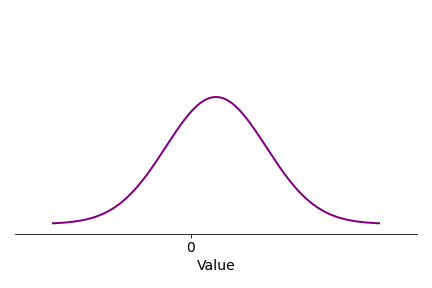
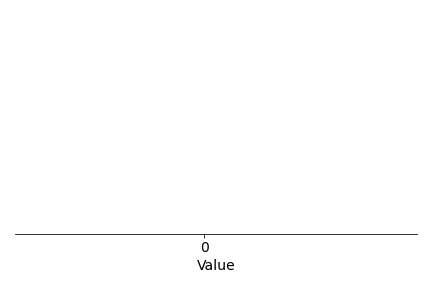
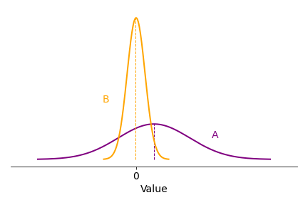
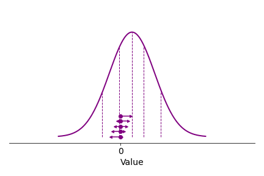

*How does your brain learn to distinguish good things from bad things, and perhaps even more difficult: something average from something that might either be very good or very bad? Are you an optimist or a pessimist, or both? And how exactly does one become one or the other?*

Consider a situation where you need to decide on what to do next, and where you have reason to believe your decision will have some sort of positive or negative impact on yourself. If you happen to be a rat in a lab where someone is doing research on reinforcement learning, you might be choosing between two levers, where one dispenses food, and the other... yeah, of course, electric shocks. Thankfully, in our human lives we are rarely directly set up for pain in this way, but the general type of choice situation is still very common, with low, high, or intermediate stakes: Which food should I pick from the buffet table? Do I cross the street now, or would it be safer to wait for that car to pass first? Which ping pong serve shold I opt for against this opponent, when she is positioned in that way, at this point in the match? If I am ahead in the game, I might play it safe and do something easy and solid, setting me up nicely for a ball that I stand a good chance of winning, but if I am behind and tired (ping pong is hard work) I might prefer to go for my difficult Deluxe Extra(TM) serve, the one which few opponents can handle but which half of the times I try it goes straight into the net.

All of these situations share the common denominator of *uncertainty* - due to inherent randomness in the world, my limited information about the state of the world, or (typically) both. For each choice (lever, road-crossing time, food, ping pong serve) I might have a rough, but generally not an exact idea of what will happen next, and how good or bad that might be for me. We can illustrate it thus, as a distribution of the probable *values* (or *rewards/punishments*, or *utilities*) of making a certain decision:

###Add plus and minus to indicate value sign###

If the distribution curve above is the "truth" about a certain situation - the *actual* distribution of expected values of a decision (for a certain decision-maker with a certain access to information about the situation) - the curve illustrates a sort-of-OK but not entirely reliable decision. It might be choosing the plain cheese pizza from the buffet, or going for one of my more run of the mill ping pong serves. The curve above shows that the outcome is more likely to be good than bad (more of the distribution of values is to the positive, right side of zero), sometimes things can go really well (the right "tail" of the distribution), but negative outcomes are also very much within the realm of possibility. 

It is clear that as decision-makers we quite often have this type of foreknowledge about our decisions. Since pizza and ping-pong both are relatively new inventions, they are not likely to be encoded in any way in our DNA (yet), meaning that any foreknowledge needs to have been acquired during the decision-maker's experience of previous similar decision situations, and stored in the decision-maker's brain somehow. Behold, a lifetime of cheese pizza slices, or attempts at that particular ping pong serve, in the form of a series of random draws from the probability distribution of values:

But how do these past experiences persist in the brain to form foreknowledge for decisions? One possibility could be that the brain remembers every single past event and exactly how well or badly it turned out, in other words storing the full and detailed set of outcomes shown above. That, however, doesn't sound quite economical. (Nor does it seem very similar to the subjective feeling of what decision-making is like, but that's not necessarily a good indicator of actual brain function). In mathematical models of reinforcement learning, for rats, humans, and robots alike, it is often instead assumed that decision-makers just keep track of a single expected value for the decision, roughly corresponding to an *average* over the values experienced in the past. More specifically, the models suggest that this happens by a simple rule: When the actual obtained value from a decision is better than our expectation (the pizza is tastier, the ping pong opponent more thrown off guard by our serve), for future reference we increase our expectation for that decision somewhat, and vice versa if the outcome is worse than expected. Here is the same life history as above, but now slowed down a little, and with an expected value - starting at zero just to start somewhere - and then ping ponging (!) about as it is getting updated after each observation:

You may notice two things: First, to keep it simple, I have stuck above to updating the expectation by the same fixed amount after each observation (in many versions of this type of model the update is bigger when the deviation between expectation and observation is bigger, and quite often it is also assumed that the update becomes smaller over time). Second, after a while the expectation comes to hover around the location of the peak of the true distribution of values. This is because once the expectation is at this location, observed values will be better than expected 50 % of the time, and worse than expected the other 50 %, such that overall there is as much movement in both directions. In other words, the expected value *converges to* the average of the true distribution. (More specifically it converges to the distribution's median; in versions of the model with bigger updates for bigger prediction errors, it would converge toward the mean - for the example distribution here median and mean are the same, though.)

This is all well and good, but it only really starts becoming useful when I apply the same learning rule to several alternative decisions. Below is a lifetime of experience of *two* different buffet choices (maybe cheese pizza vs french fries) or two different ping pong serves:

The value observations above come from two slightly different distributions - in other words the average values of the two options are not the same, but you can see that without the true distribution curves included things look rather messy (especially since I have opted to plot the two sets of observations "on top" of each other...), and it's hard to know what option to prefer. The reinforcement learning assumption, then, is that both of these past sets of experiences are kept track of by the same rule as mentioned above, but separately for each decision option. Here is the same set of observations again, slower, and with two of those little reinforcement learning ping pong balls, one for each decision option:

###Add A and B for the options###

You can see above that the reinforcement learning rather quickly settles on the idea that option A (let's say the pizza) is better, on average, than option B (the french fries), and that this is in line with the underlying true distributions - which I have included above, but which the reinforcement learning does not have access to at all. Thus, you can see that it is enough for a robot, or the brain of a rat or a human, to keep track of one such expectation per decision option, to know which option among a set of alternatives is likely to give the best average outcome - something which is obviously very useful when making these kinds of decisions.

In reality, there are of course lots of complications to this story. For example, the value of different decision alternatives might be highly context-dependent - what you expect from a food item is likely to depend on a lot of other pieces of information besides the crude identification of the item as "cheese pizza", like the exact appearance of the specific slice itself, and the general setting (are you in an Italian or a Swedish restaurant?). In this sense, we rarely face *exactly* the same decision situation multiple times, and a lot of the actual art of reinforcement learning lies in being able to make use of all of the specific bits of information available in a given situation, in a way that still draws meaningfully on past similar (but not identical) experiences, to nevertheless arrive at a sensible expectation of value for a decision option.

The specific complication I would like to highlight here, however, relates to the observation that quite often just an expectation of average value isn't enough. In the example A-B choice above, the spread of values was similar between the two options, but what if it instead had looked like this?

A is still better than B on average, but now A carries an element of risk: Its leftmost tail extends to more negative values than the leftmost tail of B, meaning that if we are unlucky, choosing A *could* turn out to be a much worse option than B. Consider for example the road-crossing situation I mentioned earlier. Crossing in front of the car (option A) will on average get us to our goal more quickly than waiting for the car to pass (option B), but it might be that the car is driving at a high speed, causing a very negative outcome in the form of a crash or a scary near-miss.

And there is really no limit to how complicated these value distributions can be. Consider the choice of ping pong serve, where my difficult Deluxe Extra(TM) signature serve yields one of two very distinct possibilities, either a very high likelihood of winning the ball, or an immediate loss, as illustrated by distribution C below:

You might notice that above I have sneakily positioned the peaks of the C distribution such that A and C have exactly the same averages, which means that if we take the shortcut of only remembering average values - by applying our average expectation learning rule - we can't distinguish between the two options, even with lots and lots of observations - quite simply because on average there is no difference:

(The expectation for C drifts around more than the one for A, because there are less observations near the average for C, making the convergence weaker, but the averages for A and C are the same.) 

This leads us to the idea of *distributional reinforcement learning*, and the whole thing about optimism and pessimism I mentioned at the outset.  The update rule we have used so far treats positive and negative value prediction errors (the deviations between expected and observed value) the same, something we could perhaps visualise as follows:

AI researchers, however, came up with a neat idea: What if the estimator responds more to one type of error, for example updating the expectation more if the observed value is lower than expected, like so?:

Look what happens now:

This expectation no longer converges to the average of the distribution, but instead to a lower, more  *pessimistic* expectation. The exact place in the distribution it converges to depends on the exact balance of how it responds to positive and negative prediction errors (the relative lengths of the leftward and rightward arrows in the illustration). We can now define as many of these expectations as we want, with different degrees of pessimism, or analogously different degrees of optimism, for expectations that get updated more for positive prediction errors:

###Plot different estimators at different y locations###

... doesn't respond much to positive prediction errors. This means that whenever that guy sees something that is better than he is predicting, he will only very weakly respond to it, and not update his prediction much, but when something is worse than his prediction, this will cause a larger shift. The effect is as follows:

GIF: A and C with pessimist learning rule

Notice what happened? Even though this prediction is wrong more than half of the time, most often predicting too small values, since the learning rule cares relatively less about these positive errors, a balance will be achieved at a value that is lower than the average. About serve A it will say.. About C: it will go into the net! ... In short, this learning rule is a pessimist. I think this is interesting... Rather than just saying that a pessimist is someone who thinks things will generally go badly, we can consider the pessimist as someone who is not so easily impressed by good news, but as soon as bad news arrive he goes "I told you so!" and massively adapts to that occasion.

And you might have guessed that to become optimist in our predictions, we just need to do the opposite, and care more about good news (positive prediction errors) than bad ones (negative prediction errors). Let's put all three learning rules together:

FIG: three learning rules

GIF: A and C with three learning rules

So now, instead of remembering each past separate occasion of A and C separately, we are keeping track of these three predictions, and this allows us to separate the safe ping pong serve from the Deluxe Extra(TM)... 

This works for any shape of the distribution of value, and we can add arbitrary numbers of little predictors of varying degrees of optimism. You can play around with this figure if you want...

FIG: Choosing arbitrary two-peak distribution, and arbitrary number of predictors

AI researchers call this *distributional reinforcement learning*... Excitingly, it has recently been shown that actually the brain might be doing exactly this. At least in rats... Measured activity in brain ZZZ detailsZZZ ... It's a nice example of a theoretical idea in AI that is borne out in actual neurobiology... 

So it might be that we are all actually both optimists and pessimists, in the sense that we are always simultaneously making both optimistic and pessimistic (and average) predictions about the outcomes of our choices.

If you want a little more mathsy detail, interactive figures, and/or the code behind the figures above, see here.

