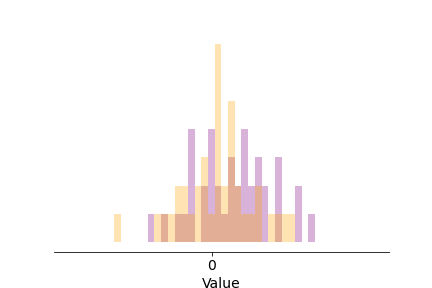

*How does your brain learn to distinguish good things from bad things, and perhaps even more difficult: something average from something that might either be very good or very bad? Are you an optimist or a pessimist, or both? And how exactly does one become one or the other?*

Consider a situation where you need to decide on what to do, and where you have reason to believe your decision will have some sort of positive or negative impact on yourself. If you happen to be a rat in a lab where someone is doing research on reinforcement learning, you might be choosing between two levers, where one dispenses food, and the other... yeah, of course, electric shocks. Thankfully, in our human lives we are rarely directly set up for pain in this way, but the general type of choice situation is still very common, with low, high, or intermediate stakes: Which food should I pick from the buffet table? Do I cross the street now, or would it be safer to wait for that car to pass first? Which ping pong serve shold I opt for against this opponent, when she is positioned in that way, at this point in the match? If I am ahead in the game, I might play it safe and do something easy and solid, setting me up nicely for a ball that I stand a good chance of winning, but if I am behind and tired (ping pong is hard work) I might prefer to go for my difficult Deluxe Extra(TM) serve, the one which few opponents can handle but which half of the times I try it goes straight into the net.

All of these situations share the common denominator of *uncertainty* - due to inherent randomness in the world, my limited information about the state of the world, or (typically) both. For each choice (lever, road-crossing time, food, ping pong serve) I might have a rough, but generally not an exact idea of what will happen next, and how good or bad that might be for me. We can illustrate it thus, as a distribution of the probable *values* (or *rewards/punishments*, or *utilities*) from making a certain decision:

###Add plus and minus to indicate value sign###

If the distribution curve above is the "truth" about a certain situation - the *actual* distribution of expected values of a decision (for a certain decision-maker with a certain access to information about the situation) - the curve illustrates a sort-of-OK but not entirely reliable decision. It might be choosing the plain cheese pizza from the buffet, or going for one of my more run of the mill ping pong serves. The curve above shows that the outcome is more likely to be good than bad (more of the distribution of values is to the positive, right side of zero), sometimes things can go really well (the right "tail" of the distribution), but negative outcomes are also very much within the realm of possibility. 

It is clear that as decision-makers we quite often have this type of foreknowledge about our decisions. Since pizza and ping-pong both are relatively new inventions, they are not likely to be encoded in any way in our DNA (yet), meaning that any foreknowledge needs to have been acquired during the decision-maker's experience of previous similar decision situations, and stored in the decision-maker's brain somehow. Behold, a lifetime of cheese pizza slices, or attempts at that particular ping pong serve, in the form of a series of random draws from the probability distribution of values:

But how do these past experiences persist in the brain to form foreknowledge for decisions? One possibility could be that the brain remembers every single past event and exactly how well or badly it turned out, in other words storing the full and detailed set of outcomes shown above. That, however, doesn't sound quite economical. (Nor does it seem very similar to the subjective feeling of what decision-making is like, but that's not necessarily a good indicator of actual brain function). In mathematical models of reinforcement learning, for rats, humans, and robots alike, it is often instead assumed that decision-makers just keep track of a single expected value for the decision, roughly corresponding to an *average* over the values experienced in the past. More specifically, the models suggest that this happens by a simple rule: When the actual obtained value from a decision is better than our expectation (the pizza is tastier, the ping pong opponent more thrown off guard by our serve), for future reference we increase our expectation for that decision somewhat, and vice versa if the outcome is worse than expected. Here is the same life history as above, but now slowed down a little, and with an expected value - starting at zero just to start somewhere - getting updated after each observation:

You may notice two things: First, to keep it simple, I have stuck above to updating the expectation by the same fixed amount after each observation (in many versions of this type of model the update is bigger when the deviation between expectation and observation is bigger, and quite often it is also assumed that the update becomes smaller over time). Second, after a while the expectation comes to hover around the location of the peak of the true distribution of values. This is because once the expectation is at this location, observed values will be better than expected 50 % of the time, and worse than expected the other 50 %, such that overall there is as much movement in both directions. In other words, the expected value *converges to* the average of the true distribution. (More specifically it converges to the distribution's median; in versions of the model with bigger updates for bigger prediction errors, it would converge toward the mean - for the example distribution here median and mean are the same, though.)

This is all well and good, but it only really starts becoming useful when I apply the same learning rule to several alternative decisions...

... Over time, this "learning rule" finds (converges toward) the average. So if I have encountered two options A and B, I can apply the same rule to both, and over time I come to learn that A is actually the sweeter option.

So, returning to the ping pong table, A and B might be different easy, solid serves, but what about option C, my Deluxe Extra(TM)? It has the following outcomes:

FIG: two normal curves for C

So let's use our learning rule and compare A and C. You might already have noticed that I have sneakily positioned the peaks of value in C such that they are equally distant to A's peak, which means that they have the same average, so our learning rule goes:

GIF: A and C with one learner

So by taking the shortcut of not remembering all of the past occasions of A and C, if the single prediction is all I have, I can't distinguish between these two possible outcomes! What to do?

... Enter a trick originally developed in AI, introducing learning rules which respond differently to prediction errors, for example like this:

FIG: pessimist learning rule

... doesn't respond much to positive prediction errors. This means that whenever that guy sees something that is better than he is predicting, he will only very weakly respond to it, and not update his prediction much, but when something is worse than his prediction, this will cause a larger shift. The effect is as follows:

GIF: A and C with pessimist learning rule

Notice what happened? Even though this prediction is wrong more than half of the time, most often predicting too small values, since the learning rule cares relatively less about these positive errors, a balance will be achieved at a value that is lower than the average. About serve A it will say.. About C: it will go into the net! ... In short, this learning rule is a pessimist. I think this is interesting... Rather than just saying that a pessimist is someone who thinks things will generally go badly, we can consider the pessimist as someone who is not so easily impressed by good news, but as soon as bad news arrive he goes "I told you so!" and massively adapts to that occasion.

And you might have guessed that to become optimist in our predictions, we just need to do the opposite, and care more about good news (positive prediction errors) than bad ones (negative prediction errors). Let's put all three learning rules together:

FIG: three learning rules

GIF: A and C with three learning rules

So now, instead of remembering each past separate occasion of A and C separately, we are keeping track of these three predictions, and this allows us to separate the safe ping pong serve from the Deluxe Extra(TM)... 

This works for any shape of the distribution of value, and we can add arbitrary numbers of little predictors of varying degrees of optimism. You can play around with this figure if you want...

FIG: Choosing arbitrary two-peak distribution, and arbitrary number of predictors

AI researchers call this *distributional reinforcement learning*... Excitingly, it has recently been shown that actually the brain might be doing exactly this. At least in rats... Measured activity in brain ZZZ detailsZZZ ... It's a nice example of a theoretical idea in AI that is borne out in actual neurobiology... 

So it might be that we are all actually both optimists and pessimists, in the sense that we are always simultaneously making both optimistic and pessimistic (and average) predictions about the outcomes of our choices.

If you want a little more mathsy detail, interactive figures, and/or the code behind the figures above, see here.

