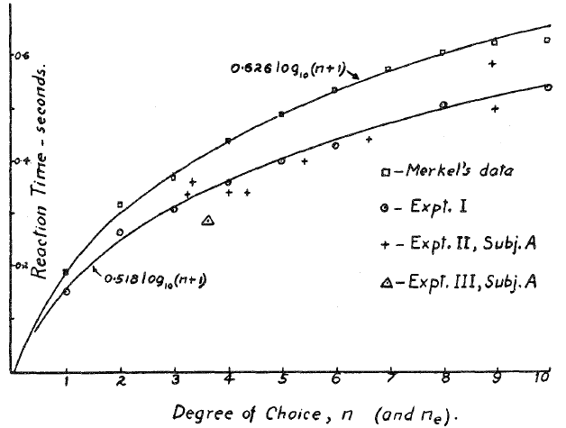

*Regardless of how much maths you know or do, you have probably heard about logarithms. Perhaps especially in the context of the "logarithmic scale" which is sometimes used to show data in graphs, for example to track the growth of a pandemic. In my job I use logarithms quite a lot, but there is still something slightly baffling about them, so I thought I'd devote this post to logarithms: what they are in terms of a general maths tool, but also how they - interestingly - turn up in human behaviour sometimes. In what ways, and why?*

Perhaps the easiest way to intuitively think about what a logarithm is, is that it is the opposite (or "inverse") of exponential growth. And by exponential growth I mean the kind of growth you get when you have a number of something, for example a number of people infected with a disease, and that number gets repeatedly scaled up by the same multiplication over and over, for example because each infected person infects a number of other people within a certain time, and then the same thing happens again and again. This pandemic example is only a little too familiar though, so let's switch to a nicer one: the number of branches or fruits in a growing tree, Click in the image to grow a tree, click again to grow a new one. 


    <iframe src="tree.html" width="100%" height="310" style="border:none"></iframe>

[TODO: stop drawing once the tree isn't growing anymore, or there is repeated slow updating + adapt to less wide windows?]

In the animation above, each new (sometimes fruit-bearing) branch gives rise to about three smaller branches, each smaller branch in turn giving rise to about three even smaller branches, and so on. So after one branching step, there are about three branches, after two branching steps 3 x 3 = 9 branches, then 3 x 3 x 3 = 27, then 81, 243, 729, and so on. Repeated upscaling by the same multiplication, in other words exponential growth. Or not quite, because in practice I have limited the maximum number of branching steps in the animation, to not have your computer crash from excessive horticulture. That's the hallmark of exponential growth really - it quickly explodes out of control:

(interactive exponential growth curve, number of branches as a function of branching steps)

And the corresponding hallmark of the logarithm, then, is that it brings this explosion back in check, by effectively instead just telling you for how long the growth has been going on, which tends to be a more manageable number. In other words, if you take the number of branches in the tree and you apply the right logarithm to that number, then you get back the number of branching steps since the tree started growing. So the logarithm of 3 is one, the logarithm of 9 is two, and the logarithms of 27, 81, 243, 729, are three, four, five, and six. Here it is, as a graph - and the curve to the right is the logarithm.

(interactive exp log mirror plot)

Note that the graph on the bottom is the same as the one above it, just shown in a logarithmic scale instead. What this means in practice is that a value y on that curve is drawn not at a height y over the zero line, as in a normal plot, but instead at a height that is the logarithm of the value y. And since the curve we are showing above is a pure exponential growth, the height of the curve is equal to the number of branching steps, which of course is also on the x axis, so it all comes back as a completely straight line. Anytime you see a straight line increase in a plot with a logarithmic y scale, you know that you are seeing exponential growth. The second thing to note in the illustration above is the little "3" in the \\(\log_3\\) - this means that we haven't just applied any logarithm, but the logarithm of "base 3". In this case, this is "the right logarithm", since the multiplication factor in the tree's growth was 3, meaning that we get back the number of branching steps like we wanted. But regardless of "base", all logarithms have the basic looks of the curve to the right above: it increases quickly first, and then the rate of increase just gets slower and slower. So precisely the opposite of exponential growth, as we said.

That's enough of the basics I think, so let's move on to the interesting thing I mentioned earlier, that logarithms sometimes turn up in human behaviour. By this I mean that human behaviour can sometimes be well described mathematically using logarithms. Probably the most famous example of this is *Hick's Law*, named after the psychologist William Edmund Hick. In the early 1950s, he was doing experiments where participants learned to associate a number of different stimuli with different responses - in his case lamps with buttons. So the task for a participant in Hick's experiment was to look at a number of lamps, between one and ten of them, while keeping fingers ready on the same number of buttons, and when one of the lamps came on, the participant had to press the button corresponding to that lamp as quickly as possible. And what Hick found was that the response time - the time between lamp illumination and button press - increased logarithmically with the number of response alternatives:

*Figure from [Hick's 1952 paper](https://journals.sagepub.com/doi/10.1080/17470215208416600) (behind a paywall), showing logarithmic growth of response times for a few different datasets. Hick's Law is sometimes called the Hick-Hyman Law instead, also crediting Ray Hyman, who did [similar work](https://psycnet.apa.org/record/1954-00412-001) at about the same time.*

Lots of experiments of this general nature have been carried out in the decades since Hick's paper, and quite often people have found the same logarithmic increase of response time with the number of response alternatives. Some of the experiments have been quite substantially different from the original speeded stimulus-response type of task. For example, [it has been shown](https://doi.org/10.1080/10447318.2017.1306940) that when a driver looks away from the road toward a familiar graphical user interface to press a button on a touch screen, the time needed to land the eyes on the correct button scales logarithmically with the number of buttons on the screen. In [another study](https://doi.org/10.1016/j.jmp.2009.09.002), on decision-making in a more slower-paced setting, participants observed a number of growing stacks of blocks, and were to respond as soon as they felt that they knew which stack was growing more quickly than the others. Again the logarithmic Hick's Law pattern appeared, as a function of the number of stacks being observed. So the general, recurring idea is that the time needed to decide on the correct thing to do grows logarithmically with the number things being decided between.

If you want to, you can have a go yourself at a Hick-like task below. Your mission, should you choose to accept it, is to wait for a fruit to appear at the top of the little screen, and then move your cursor to the white circle corresponding to that fruit as quickly as you possibly can. To start a trial, place your cursor in the middle white circle. (If you are using a touch screen rather than a mouse, to start a trial tap the middle circle then keep your finger over it - no cheating!). Before each trial the fruit that may be shown are highlighted - that's your varying number of response alternatives. By default the maximum is four alternatives, but you can toggle the maximum to eight if you want to challenge yourself further. I am not sure how it will work out for you, but for me, once I have practiced enough to know pretty well where all the fruit are, my response times (plotted at the bottom of the screen as you go) do look quite logarithmic. If you want to restart the game after having practiced for a while, just do a long click/press anywhere in the screen.

(Hicks fruit game)

So why on earth is there a logarithm here...? Hicks had his own thoughts about this... couched in terms of information theory which was really new and hot at the time... Title of the paper: "On the rate of gain of information"... in bits... One or zero... If you are specifying a higher number you need a larger number of bits... And how does the number of bits you need grow with the number of you want to specify? Logarithmically. And the reason for this is that again we get back to the idea of a tree...

(interactive tree plot - height chosen by mouse Y, target fruit chosen by mouse X)

So Hicks suggestion was that the brain is dealing with this decision situation by way of a kind of divide and conquer, iteratively dividing the search space for the right response into smaller and smaller parts. Intuitively, in the fruit game, this could be something like.... "I know the banana is in the right half... I know that it is in the lower part of the right half" ... And the fewer target locations you have to choose from, the quicker there will only be one location left, which will then be the right answer. So the "rate of gain of information" can be thought of as "how quick is the brain at iteratively dividing the search space?"...

A kind of search - squares with the driver touch screen example above... Maybe less so with the "stack of blocks" example? ... Brown and colleagues also showed that the logarithmic pattern can actually be an optimal way of ensuring a consistent rate of accuracy... although in practice as you may have noticed quite often accuracy also tends to go down with the number of decision alternatives...  -

So is the brain really doing something like this? That is a big and interesting question, and has been tackled by a lot of people in different ways... Somewhat of a benchmark for models of how the brain solves this type of decision challenge... Again a topic for a different post...

