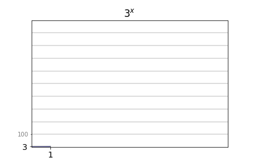

*Regardless of how much maths you know or do, you have probably heard about logarithms. Perhaps especially in the context of the "logarithmic scale" which is sometimes used to show data in graphs, for example to track the growth of a pandemic. In my job I use logarithms quite a lot, but there is still something slightly baffling about them, so I thought I'd devote this post to logarithms: what they are in terms of a general maths tool, but also how they - interestingly - turn up in human behaviour sometimes. The specific case we'll look at provides a nice overview of a number of different ways in which human behaviour can be modelled mathematically, using models of a "descriptive", "normative", or "mechanistic" nature.* 

Perhaps the easiest way to intuitively think about what a logarithm is, is that it is the opposite (or "inverse") of exponential growth. And by exponential growth I mean the kind of growth you get when you have a number of something, for example a number of people infected with a disease, and that number gets repeatedly scaled up by the same multiplication over and over, for example because each infected person infects a number of other people within a certain time, and then the same thing happens again and again. This pandemic example is only a little too familiar though, so let's switch to a nicer one: the number of branches or fruits in a growing tree, Click in the image to grow a tree, click again to grow a new one. 


    <iframe src="tree.html" width="100%" height="310" style="border:none"></iframe>

[TODO: stop drawing once the tree isn't growing anymore, or there is repeated slow updating + adapt to less wide windows?]

In the animation above, each new (sometimes fruit-bearing) branch gives rise to about three smaller branches, each smaller branch in turn giving rise to about three even smaller branches, and so on. So after one branching step, there are about three branches, after two branching steps 3 x 3 = 9 branches, then 3 x 3 x 3 = 27, then 81, 243, 729, and so on. Repeated upscaling by the same multiplication, in other words exponential growth. Or not quite, because in practice I have limited the maximum number of branching steps in the animation, to not have your computer crash from excessive horticulture. That's the hallmark of exponential growth really - it quickly explodes out of control:

[TODO: Add axis labels.]

And the corresponding hallmark of the logarithm, then, is that it brings this explosion back in check, by effectively instead just telling you for how long the growth has been going on, which tends to be a more manageable number. In other words, if you take the number of branches in the tree and you apply the right logarithm to that number, then you get back the number of branching steps since the tree started growing. So the logarithm of 3 is one, the logarithm of 9 is two, and the logarithms of 27, 81, 243, 729, are three, four, five, and six, and so on. Below is the same exponential growth again, and to the right of it is the corresponding logarithmic curve.

[TODO: Add axis labels.]

The graph on the bottom shows the same exponential growth curve as in the graph above it, but now shown in a logarithmic scale instead. What this means in practice is that a value y on that curve is drawn not at a height y over the zero line, as in a normal plot, but instead at a height that is the logarithm of the value y. And since the curve we are plotting is a pure exponential growth, the logarithm of it is equal to the number of branching steps, which of course is also what is on the x axis, so it all comes back as a completely straight line. Anytime you see a straight line increase in a plot with a logarithmic y scale, you know that you are seeing exponential growth. The second thing to note in the illustration above is the little "3" in the \\(\log_3\\) above the logarithmic curve - this means that we aren't showing just any logarithm, but the logarithm of "base 3". In this case, this is "the right logarithm", since the multiplication factor in the tree's growth was 3, meaning that we get back the number of branching steps correctly for our specific tree. But regardless of "base", all logarithms have the basic looks of the curve to the right above: it increases quickly first, and then the rate of increase just gets slower and slower. So precisely the opposite of exponential growth, as we said.

That's enough of the basics I think, so let's move on to the interesting thing I mentioned earlier, that logarithms sometimes turn up in human behaviour. By this I mean that human behaviour can sometimes be well described mathematically using logarithms. Probably the most famous example of this is *Hick's Law*, named after the psychologist William Edmund Hick. In the early 1950s, he was doing experiments where participants learned to associate a number of different stimuli with different responses - in his case lamps with buttons. So the task for a participant in Hick's experiment was to look at a number of lamps, between one and ten of them, while keeping fingers ready on the same number of buttons, and when one of the lamps came on, the participant had to press the button corresponding to that lamp as quickly as possible. And what Hick found was that the response time - the time between lamp illumination and button press - increased logarithmically with the number of response alternatives:

*Figure from [Hick's 1952 paper](https://journals.sagepub.com/doi/10.1080/17470215208416600) (behind a paywall), showing logarithmic growth of response times for a few different datasets. Hick's Law is sometimes called the Hick-Hyman Law instead, also crediting Ray Hyman, who did [similar work](https://psycnet.apa.org/record/1954-00412-001) at about the same time.*

Hick's Law is an example of a *descriptive* model of human behaviour, which means that it simply describes what the observed behaviour looks like, without going into further detail about why or how the behaviour is like it is. Lots of experiments of the same general nature as Hick's have been carried out in the decades since Hick's paper, and quite often people have found the same logarithmic increase of response time with the number of response alternatives. Some of the experiments have been quite substantially different from the original speeded stimulus-response type of task. For example, [it has been shown](https://doi.org/10.1080/10447318.2017.1306940) that when a driver looks away from the road toward a familiar graphical user interface to press a button on a touch screen, the time needed to land the eyes on the correct button scales logarithmically with the number of buttons on the screen. In [another study](https://doi.org/10.1016/j.jmp.2009.09.002), on decision-making in a more slow-paced setting, participants observed a number of growing stacks of blocks (kind of like Tetris), and were to respond as soon as they felt that they knew which stack was growing more quickly than the others. Again the logarithmic Hick's Law pattern appeared, as a function of the number of stacks being observed. So the general, recurring idea is that the time needed to decide on the correct thing to do grows logarithmically with the number things being decided between. 

If you want to, you can have a go yourself at a Hick-like task below. Your mission, should you choose to accept it, is to wait for a fruit to appear at the top of the little screen, and then move your cursor to the white circle corresponding to that fruit as quickly as you possibly can. To start a trial, place your cursor in the middle white circle. (If you are using a touch screen rather than a mouse, to start a trial tap the middle circle then keep your finger over it - no cheating!). Before each trial the different fruits that may be shown are highlighted - that's your varying number of response alternatives. By default the maximum is four alternatives, but you can toggle the maximum to eight if you want to challenge yourself further. I am not sure how it will work out for you, but for me, once I have practiced enough to know pretty well where all the fruits are, my response times (plotted at the bottom of the screen as you go) do look quite logarithmic. If you want to restart the game after having practiced for a while, just do a long click/touch anywhere in the screen.

(Hicks fruit game)

So why on earth is there a logarithm here? Hick himself had his own thoughts about this, and he couched them in terms of *information theory*, which was a new and very hot topic at the time. In fact, he named his 1952 paper *"On the rate of gain of information"*. He considered that if you are a participant looking at his display of lamps, with one lamp just having lit up, you are in the process of acquiring information about what button to press, and that information can be measured in bits, where each bit is either a zero or a one, just the way we still to this day measure information stored in and transmitted between computers. If you have, say, ten different response options, the information you want to acquire is a number between one and ten that tells you which button is the right one, and if you get that information as bits (binary code zeros and ones), the number of bits you need to receive before you know the answer is larger than if you were choosing between only, say three response buttons, and thus were waiting only for a number between one and three. And how does the number of bits grow with the maximum size of the number you are receiving? Well logarithmically of course. The reason for this is that again we get back to the idea of a tree:

(interactive tree plot - height chosen by mouse Y, target fruit chosen by mouse X)

So Hick's suggestion was that the brain might be dealing with decision situations by way of a kind of divide and conquer, iteratively splitting the pool of decision alternatives into smaller and smaller parts. Intuitively, in the fruit game you played above, upon seeing the banana your brain could be going through a process like: "I know the banana is in the right half. I know that it is in the lower part of the right half. I know it is..." In other words, the "rate of gain of information" that Hick was after can be thought of as "how quick is the brain at iteratively dividing the space of decision options?" This explanation for the logarithmically increasing response times is an example of what can be referred to as a *"mechanistic model"* of human behaviour, in that it describes a hypothesised underlying mechanism that gives rise to the behaviour. 

So is this hypothesis correct? Is this how the brain is actually doing it? Believe it or not, but I don't have a clear-cut final answer for you. Hick himself actually already had his own doubts, because he argued that if the underlying process was indeed a number of divisions of the pool of alternatives, then response times should take on a limited number of values, as multiples of the shortest response time, but that isn't really the case. Also other critiques were raised already by Hick's contemporaries (see for example [this review paper](https://doi.org/10.1080%2F17470218.2017.1322622), which also provides a nice discussion on the circumstances under which Hick's Law has been found to break down), and nowadays I think few people would argue that tree search is a serious contender for a good mechanistic model of this phenomenon.

However interestingly, two other things have instead been shown: First, that this type of way of responding to decision tasks of increasing complexity can be seen as "optimal"... in terms of choice accuracy or reward over time ... In neuroscientific detail, the leading explanations for exactly *how* the brain is doing this, is in terms of evidence accumulation to threshold... Gthering evidence for each possible alternative - evidence is assumed to come either from memory... or from perceptual input... And when the more such evidence accumulation processes are ongoing at the same time (the more decision alternatives), the more they get in the way of each other, causing a gradual slowing of evidence accumulation with increasing decision complexity, in a way that produces an (at least approximately) logarithmic increase of response times.

In this way, Hick's Law provides a very nice example of a number of different types of models of human behaviour... first only as a "descriptive" model of how humans actually behave, then interpreted by Hick in terms of a "mechanistic" model of tree search... then shown come out of a "normative" account, saying that it is optimal to behave "as if" one were doing something like a divide and conquer tree search, and then shown again mechanistically how actual groups of neurons in the brain might achieve this type of behaviour.

